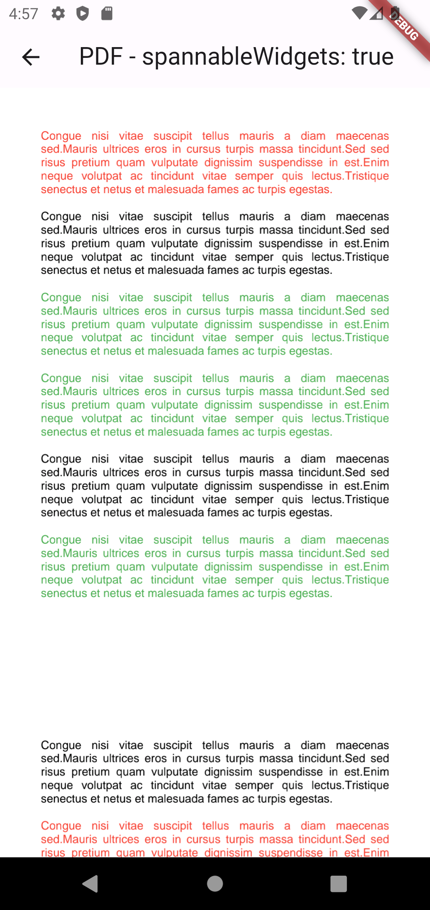
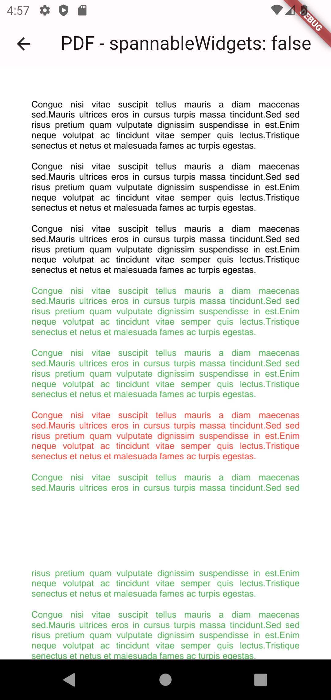

Helps you to build pdf files with widgets that don't exceed to other pages. For example
when you have a Paragraph widget where it is placed at the end of the page and its some part
is put on the incoming pagei, this package place the whole paragraph in the same page.

## Features

  <div display= "flex">
    
    
  </div>

## Getting started

This package is based on [pdf](https://pub.dev/packages/pdf) package. You also need to have a dependency to it.

## Usage

Complete example can be found in `/example/example.dart`.

```dart
/// ...
/// initialize your sample pdf that will calculate
/// calculate widgets' sizes
final samplePdf = pw.Document();


 samplePdf.addPage(
    pw.MultiPage(
      pageFormat: PdfPageFormat.a4.copyWith(height: 100.0),
      build: (context) {
        return <pw.Widget>[
          pdfRepo
              .add(
                key: 'unique-widget-key',
                pdfSpannableWidgetBase: PdfSpannableWidget(
                    widget: pw.Placeholder() // your widget will come here.,
                    ),
              )
              .widget,

          /// ... more widgets
        ];
      },
    ),
  );

  /// return your generated pdf.
  return await pdfRepo.createPdf();
```

## Additional information

If you want to contribute to the code, you can create pull requests.
